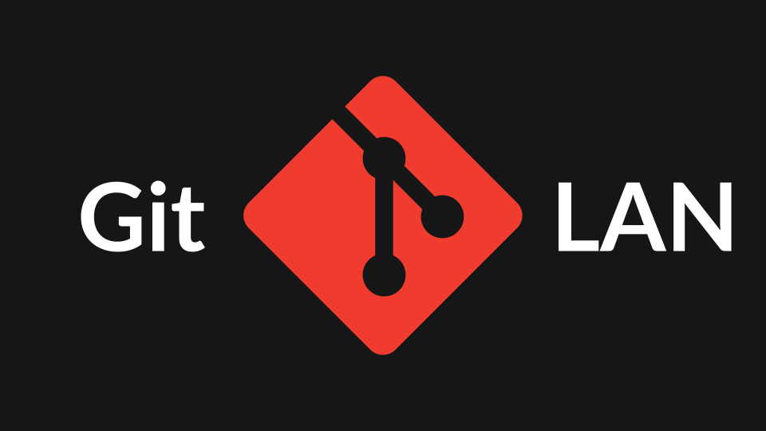

<p align="center">
  
</p>

<h1 align="center">git-lan</h1>

[](https://go.dev)
[](LICENSE)
[](#installation)
[](SECURITY.md)

**Share git repositories with people on the same network - no server, no
account, no GitHub, no configuration.** Start a session, and colleagues discover
you over mDNS and can clone, push, and pull instantly. Every byte between peers
is end-to-end encrypted.

```console
$ git lan session create --name hackathon
✓ session "hackathon" is live
  port:        9418 (encrypted)
  fingerprint: SHA256:Hk9s2…

# on a colleague's machine, on the same Wi-Fi:
$ git lan list
● maciek-laptop  main  abc1234  just now   hackathon
$ git lan clone maciek-laptop/project
```

> **Nerd Fonts - optional but recommended**
>
> git-lan auto-detects whether your terminal supports Nerd Fonts glyphs and
> remembers the result per terminal profile. Nothing to configure. Install a
> patched font from [nerdfonts.com](https://www.nerdfonts.com) for the nicest
> output; plain terminals fall back to clean ASCII automatically.

---

## Why

Sometimes the network *is* the room you're in.

- **Hackathons** - share a repo with your team in seconds, even when the venue
  Wi-Fi has no internet.
- **Classrooms & workshops** - an instructor shares starter code; students clone
  without accounts.
- **Game jams** - push builds to a teammate across the table.
- **CTF / airgapped labs** - collaborate where there is deliberately no internet.
- **Anywhere GitHub is overkill** - you just want to hand someone a repo.

No central server means nothing to set up, nothing to trust but the people in
the room, and nothing that stops working when the internet does.

## Features

- **Zero-config discovery** - peers appear automatically over mDNS/DNS-SD.
- **End-to-end encryption** - X25519 handshake, ChaCha20-Poly1305, per-direction
  keys, anti-replay. No plaintext ever crosses the wire.
- **Trust on first use** - pin peer fingerprints; loud man-in-the-middle
  warning on mismatch.
- **Sessions** - name a share, optionally password-protect it (Argon2id), mint
  one-time invite tokens.
- **Live presence** - see who is online, coding, or idle, with branch and HEAD.
- **Conflict early-warning** - find out *before* you push that a teammate has
  uncommitted work.
- **Nerd Fonts auto-detection** - cached per terminal profile, no flags needed.
- **Cross-platform** - Linux, macOS (Intel + Apple Silicon), Windows.

## Quick Start

```console
# 1. In a git repo, start sharing it:
git lan session create --name demo

# 2. On another machine on the same LAN, see who's around:
git lan list

# 3. Clone their repo over the encrypted transport:
git lan clone <peer>/demo

# 4. Watch the room live:
git lan status
```

That's it - there is no step 5.

## Command reference

| Command | What it does |
| --- | --- |
| `git lan list` | List peers on the LAN with branch, HEAD, presence. Also shows your own active session (a host is filtered out of its own mDNS results). |
| `git lan status` | Live dashboard, refreshes every 5s (Ctrl+C to exit). Includes your own active session. |
| `git lan clone <peer>[/repo] [dir]` | Clone a peer's repo over E2E transport. |
| `git lan pull <peer>[/repo] [branch]` | Pull from a peer into the current repo. |
| `git lan push <peer>[/repo] [branch]` | Push to a peer (peer approves). |
| `git lan session create` | Share the current repo. `--name`, `--password`, `--allow-push`. |
| `git lan session join <peer>[/repo]` | Join a session. `--password`, `--token`. |
| `git lan session invite` | Mint a one-time, expiring join token. |
| `git lan session leave` | Clear active session state. |
| `git lan trust add <host> <fingerprint>` | Pin a peer's fingerprint. |
| `git lan trust remove <host>` | Remove a pin. |
| `git lan trust list` | List trusted peers. |
| `git lan config` | Show resolved config and paths. |
| `git lan config --detect-fonts` | Re-probe Nerd Fonts for this terminal. |
| `git lan completion <shell>` | Shell completion (bash/zsh/fish/powershell). |

Global flags: `--no-nerd-fonts`, `--no-color`, `--verbose`, `--version`.

### Examples

```console
# Share with a password and allow pushes back:
git lan session create --name sprint --password hunter2 --allow-push

# Invite someone without telling them the password:
git lan session invite --ttl 30m

# Join a locked session:
git lan session join bartek-pc/sprint --password hunter2
# ...or with a one-time token:
git lan session join bartek-pc/sprint --token 3xK9mQ2…

# Pin a colleague after verifying their fingerprint out of band:
git lan trust add maciek-laptop SHA256:Hk9s2…
```

## Architecture

```
   [Peer A]                         [Peer B]
      │                                │
      ├── mDNS broadcast ─────────────>│  discovery layer
      │<── mDNS broadcast ─────────────┤  (_gitlan._tcp, TXT metadata)
      │                                │
      ├── TCP connect ────────────────>│
      ├── X25519 ephemeral handshake ->│  E2E encryption
      │<── X25519 ephemeral handshake ─┤  directional session keys established
      │                                │
      ╔════════════════════════════════╗
      ║  ChaCha20-Poly1305 encrypted   ║
      ╠════════════════════════════════╣
      ║  git push / pull / clone       ║  transport layer
      ╚════════════════════════════════╝
```

git itself never sees the network: on the serving side a one-shot
`git daemon --inetd` reads and writes the *decrypted* stream; on the client side
git talks to a loopback bridge that encrypts before anything leaves the machine.

## Security model

Every peer connection is end-to-end encrypted before a single git byte flows:
ephemeral X25519 for forward secrecy, long-term identity keys mixed in to defeat
man-in-the-middle, HKDF-derived per-direction ChaCha20-Poly1305 keys, and strict
nonce anti-replay. Sessions add Argon2id passwords and one-time HMAC invite
tokens. Peer fingerprints are pinned; a mismatch aborts loudly.

mDNS TXT records are broadcast in the clear **by design** and contain only
harmless metadata (repo name, branch, short HEAD, modified count, session name,
lock flag, presence) - never keys, passwords, or file contents.

See **[SECURITY.md](SECURITY.md)** for the full threat model and details.

## Nerd Fonts

git-lan detects Nerd Fonts support **per terminal profile** and caches the
result, so it probes at most once per terminal.

1. It builds a stable key for your terminal (Windows Terminal profile GUID,
   `TERM_PROGRAM`, `TERM`, etc.).
2. It checks `terminal_profiles.toml` for a cached result.
3. On a cache miss in a real TTY, it draws a glyph and measures cursor movement
   with ANSI cursor-position queries to decide if the font rendered it.
4. It caches the answer under your terminal's profile key.

Override order (highest first):

1. `--no-nerd-fonts` flag
2. `nerd_fonts = true|false` in `config.toml`
3. cached per-profile result
4. live TTY probe
5. non-TTY → plain icons

Force a re-probe (e.g. after switching fonts):

```console
git lan config --detect-fonts
```

### `terminal_profiles.toml`

Stored in the config directory; one entry per terminal profile:

```toml
[profiles."windows-terminal:{2c4de342-38b7-51cf-b940-2309a097f518}"]
nerd_fonts = true
detected_at = "2025-04-10T18:22:00"

[profiles."vscode:"]
nerd_fonts = false
detected_at = "2025-04-10T18:25:13"
```

## Installation

### Quick install (any platform)

```console
go install github.com/matixandr/git-lan@latest
```

`git` resolves `git lan` to any `git-lan` executable on your `PATH`, so once it's
installed the subcommand just works. The binary lands in `$(go env GOPATH)/bin` -
make sure that directory is on your `PATH`. Requires **Go 1.26+**.

### From source

```console
git clone https://github.com/matixandr/git-lan
cd git-lan
# Unix:
./scripts/install.sh
# Windows (PowerShell):
./scripts/install.ps1
```

### Cross-compiled binaries

```console
make dist     # builds dist/git-lan-<os>-<arch> for all supported platforms
```

### Requirements

- **git** in your `PATH` (git-lan shells out to it).
- **Go 1.26+** to build from source.
- **mDNS** on the network. Linux typically uses Avahi; macOS has Bonjour
  built in; on **Windows**, install **Bonjour** (bundled with iTunes or the
  Bonjour Print Services package) if peer discovery comes up empty.

### Config directory

| Platform | Location |
| --- | --- |
| Linux | `$XDG_CONFIG_HOME/gitlan` or `~/.gitlan` |
| macOS | `~/.gitlan` |
| Windows | `%APPDATA%\gitlan` |

Holds `config.toml`, `identity.key` (0600), `sessions.json`,
`trusted_peers.json`, and `terminal_profiles.toml`.

## Known limitations

- **LAN only, by design.** git-lan does no NAT traversal and is not meant to
  reach across the internet. That's the point.
- **No web UI.** It's a CLI.
- **Discovery needs working mDNS.** Some corporate networks block multicast;
  there is nothing git-lan can do about that.
- **Not audited.** The cryptography is conventional and carefully built, but this
  is a hobby project - don't guard state secrets with it.

## Contributing

Issues and pull requests welcome. Keep changes focused, run `go vet ./...` and
`go test ./...` before submitting, and match the existing style. The codebase is
small and organized by concern under `internal/` - start with the package whose
name matches what you're touching.

## License

MIT © matixandr - see [LICENSE](LICENSE).

Git logo by Jason Long, licensed under [CC BY 3.0](https://creativecommons.org/licenses/by/3.0/) ([git-scm.com/downloads/logos](https://git-scm.com/downloads/logos)).
